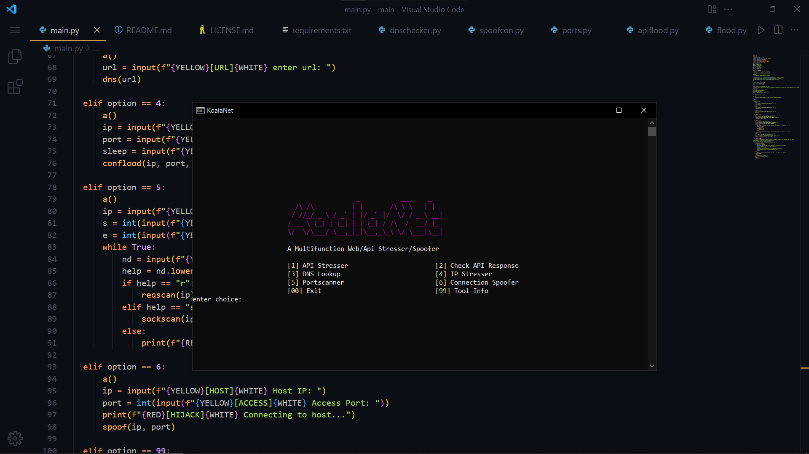
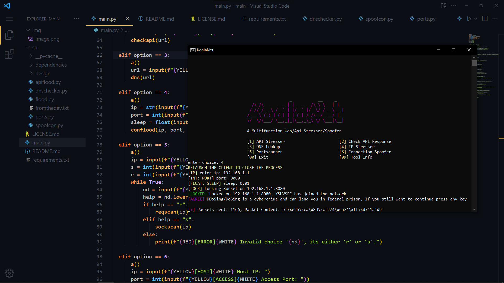

# KOALANET
- KoalaNet is a basic ip/api stresser coded using low level network communication library; socket and requests. Each request is fully customisable as they are fetched from the json and headers file located in `/dependencies` directory. 

- All the modules are located in `/src` directory, make sure to check them out.

# INSTALLATION
- [LINUX] Clone the project using the git framework
```shell
git clone https://github.com/infamouskoala/koalanet
cd koalanet
pip3 install -r requirements.txt
python main.py
```

- [WINDOWS] Download the files and extract the zip.
```powershell
cd path/to/folder
pip install -r requirements.txt
py main.py
```

# FAIR USE
- This tool is for ethical/educational purposes only, in order to attack someone outside your personal network (localhost) one will need to modify their router settings to allow sending traffic from the devices on it (port forwarding). Stick to testing out this script on your local host and with proper permission from the victim. This tool or the developer will not be held responsible for any damages caused by the misuse of its user.

# PREVIEW

